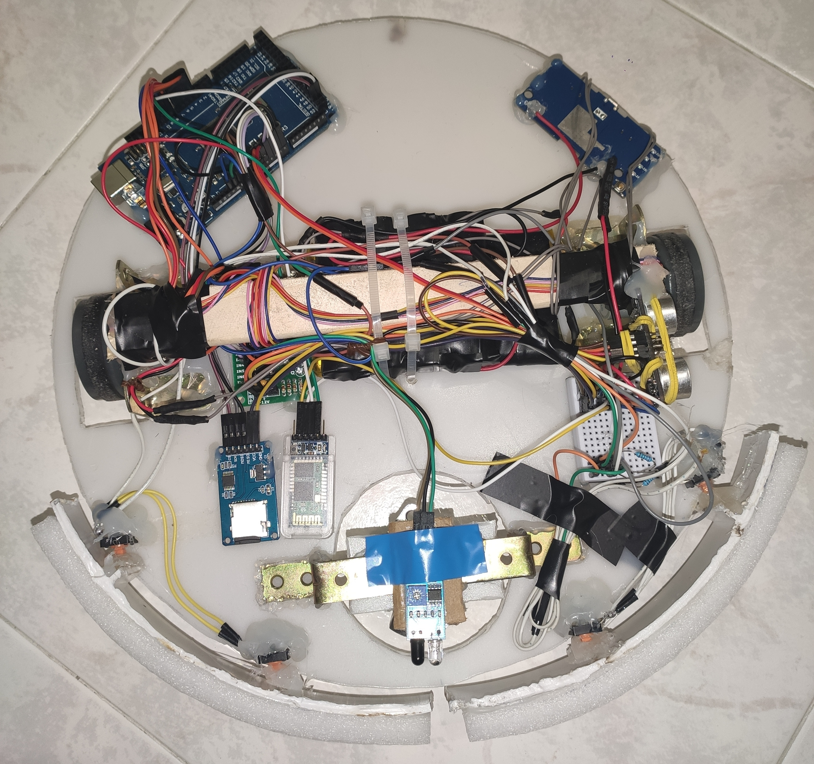

# WallTrackRobot

## Description

This project aims to develop an autonomous robot capable of mapping its surroundings while navigating along walls. Utilizing Arduino microcontroller technology and a set of sensors, the robot follows a wall, continuously scanning and mapping its environment. The mapped data is stored on an SD card for further analysis or visualization. This project combines elements of robotics, sensor interfacing, and algorithmic development to create a versatile mapping solution.

## Key Features

<b>Autonomous Navigation:</b> The robot is programmed to autonomously follow walls using a combination of sensors and control algorithms. 
<b>Real-Time Mapping:</b> As the robot traverses its environment, it dynamically creates a map, recording wall positions and obstacles. 
<b>Sensor Integration:</b> Various sensors, such as ultrasonic or infrared sensors, are utilized to detect walls and obstacles, enabling precise navigation. 
<b>Data Storage:</b> Mapped data is stored on an SD card, providing a convenient and portable means for data retrieval and analysis. 
<b>Expandability:</b> The project is designed to be easily expandable, allowing for the addition of new sensors or functionalities for custom applications.

## Components

<b>Arduino Mega 2560:</b> A powerful microcontroller board based on the ATmega2560 chipset, offering ample digital and analog pins for versatile project development. 
<b>DC Motor:</b> An electric motor powered by direct current, commonly used for driving mechanical components or systems such as wheels or robotic arms. 
<b>Ultrasonic Sensor:</b> A sensor that emits ultrasonic pulses and measures the time it takes for them to bounce back, used for distance measurement or object detection based on echo reception. 
<b>Infrared Sensor:</b> A sensor that detects infrared radiation emitted by objects, commonly used for proximity sensing, obstacle detection, or line following in robotics. 
<b>SD Card Module:</b> A module that interfaces with SD (Secure Digital) memory cards, allowing data storage and retrieval for applications such as logging sensor data or storing multimedia files. 
<b>Bluetooth Module:</b> A module that enables wireless communication via Bluetooth protocol, facilitating data exchange between the Arduino and external devices such as smartphones, tablets, or computers. 
<b>Buttons:</b> Mechanical switches used as input devices, typically for user interaction or control purposes in electronic projects. They can trigger specific actions or states within the system when pressed or released.

## Code

[Click here for code!](Code.ino)

## Useful links

[How to program in multitasking](https://github.com/bxparks/AceRoutine/blob/develop/USER_GUIDE.md)

